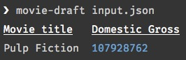

# movie-draft-default-reporter

> Print movie draft data output to the console.

[](https://npmjs.org/package/movie-draft-default-reporter)
[](https://travis-ci.org/alebelcor/movie-draft-default-reporter)
[](https://coveralls.io/github/alebelcor/movie-draft-default-reporter)



## Install

```bash
npm install --save movie-draft-default-reporter
```

## Usage

```js
var defaultReporter = require('movie-draft-default-reporter');

defaultReporter([ { title: 'Pulp Fiction', domesticGross: 107928762 } ]); // outputs results to console
```

## API

### defaultReporter(data)

Prints the movie draft data output to the console.

#### data

Type: `array` of `objects`

An array of objects containing the data for one or more movies as outputted by the `movie-draft` [package](https://github.com/alebelcor/movie-draft).

## License

MIT © Alejandro Beltrán
